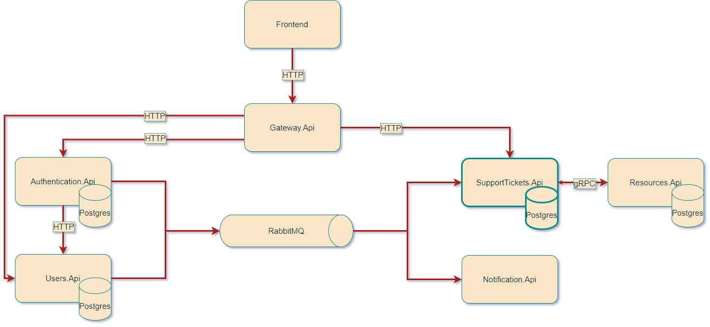

# HelpDeskSystem

This is a sample of help desk web service with using microservice.
This service contains backend with using ASP.NET Core and frontend with using jQuery.
The entire service is containerized by using docker.
The primary goal of this sample is to demonstrate microservice backend with several microservice
concepts and containerization.

Each solution has readme file that contains description:

* [Gateway.Api](Gateway.Api/README.md)
* [SupportTickets.Api](SupportTickets.Api/README.md)
* [Authentication.Api](Authentication.Api/README.md)
* [Users.Api](Users.Api/README.md)
* [Resources.Api](Resources.Api/README.md)
* [Notification.Api](Notification.Api/README.md)
* [Infrastructure](Infrastructure/README.md)
* [Infrastructure.Authentication](Infrastructure.Authentication/README.md)
* [RabbitMqInitializer](RabbitMqInitializer/README.md)
* [SupportTickets.Tests](SupportTickets.Tests/README.md)
* [Frontend](Frontend/README.md)

## Architecture



Each microservice has its own technology stack and uses its own database.
For communication between microservices, using asynchronous messaging with using RabbitMQ, and
synchronous communication with using REST and gRPC calls.

## CI/CD

For CI/CD, this repository uses [GitHub Actions](https://resources.github.com/ci-cd/).

## How to run

To run containers use:

```bash
docker-compose build
docker-compose up -d
```

After run, it will take some time until [RabbitMqInitializer](RabbitMqInitializer/README.md) will not complete its
work and until the service databases migrations are completed
